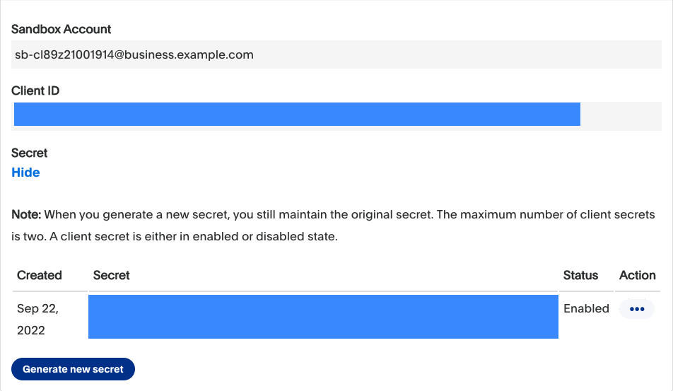

<div align="center">
  <a href="https://twitter.com/paypaldev" target="_blank">
    
  </a>
  <br />
  <a href="https://twitter.com/paypaldev" target="_blank">Twitter</a>
    <span>&nbsp;&nbsp;-&nbsp;&nbsp;</span>
  <a href="https://www.paypal.com/us/home" target="_blank">PayPal</a>
    <span>&nbsp;&nbsp;-&nbsp;&nbsp;</span>
  <a href="https://developer.paypal.com/home" target="_blank">Docs</a>
    <span>&nbsp;&nbsp;-&nbsp;&nbsp;</span>
  <a href="https://github.com/paypaldev" target="_blank">Code Samples</a>
    <span>&nbsp;&nbsp;-&nbsp;&nbsp;</span>
  <a href="https://dev.to/paypaldeveloper" target="_blank">Blog</a>
  <br />
  <hr />
</div>

# PayPal JavaScript FullStack 3Ds Advanced Checkout
This sample app shows you how to build and customize a card payment form to accept debit and credit cards and use 3Ds for authentification. Please make sure to style the card form so that it aligns with your business branding.

To create this application from scratch, follow the [Advanced Checkout integration](https://developer.paypal.com/docs/checkout/advanced/integrate) guide from the [PayPal Developer](https://developer.paypal.com/home) docs.

## Run this project

### PayPal Codespaces
[](https://codespaces.new/paypaldev/PayPal-JavaScript-FullStack-3Ds-Advanced-Checkout-Sample?devcontainer_path=.devcontainer%2Fdevcontainer.json)

- Rename the ``.env.example`` file to `.env`.
- Add your environment variables in the `.env` file.
```shell
PAYPAL_CLIENT_ID=YOUR_CLIENT_ID
PAYPAL_
```
### Locally

- Rename the `.env.example` file to `.env`.
- Add your environment variables in the `.env` file.

```shell
PAYPAL_CLIENT_ID=YOUR_CLIENT_ID
PAYPAL_CLIENT_SECRET=YOUR_APP_SECRET
```

Complete the steps in [Get started](https://developer.paypal.com/api/rest/) to get the following sandbox account information from the Developer Dashboard:
- Sandbox client ID and the secret of [a REST app](https://www.paypal.com/signin?returnUri=https%3A%2F%2Fdeveloper.paypal.com%2Fdeveloper%2Fapplications&_ga=1.252581760.841672670.1664266268).
- Access token to use the PayPal REST API server.



Now, run the following command in your terminal:

`npm install`

`npm run start`

and navigate in your browser to: `http://localhost:9597/`.

### Sample Card

#### Succesful 3Ds Authentification
Card Type: `Visa`

Card Number: `5458406954745076`

Expiration Date: `01/2025`

CVV: `123`

#### Failure 3Ds Authentification

Card Type: `Visa`

Card Number: `4928527426776525`

Expiration Date: `01/2025`

CVV: `123`

## PayPal Developer Community
The PayPal Developer community helps you build your career while improving your products and the developer experience. You’ll be able to contribute code and documentation, meet new people and learn from the open-source community.
 
* Website: [developer.paypal.com](https://developer.paypal.com)
* Twitter: [@paypaldev](https://twitter.com/paypaldev)
* GitHub:  [@paypal](https://github.com/paypal)
